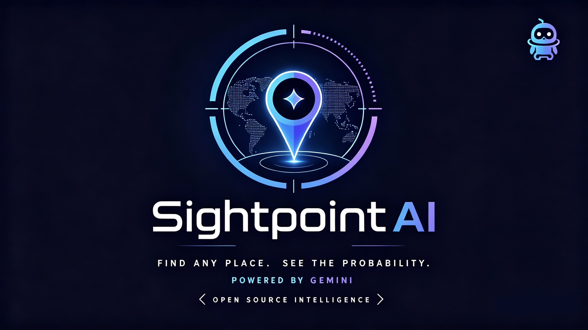
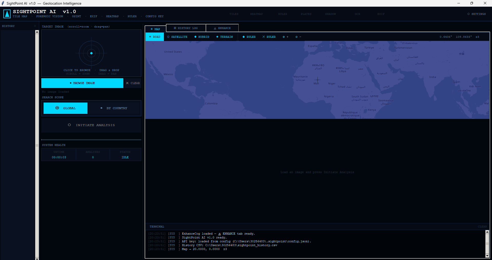
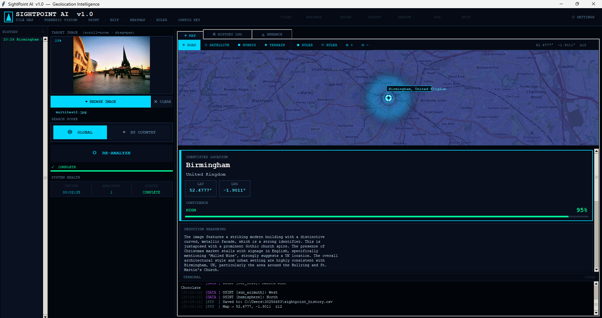
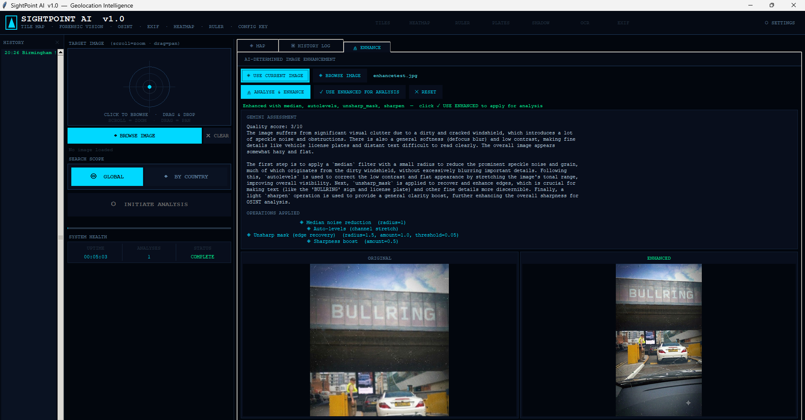
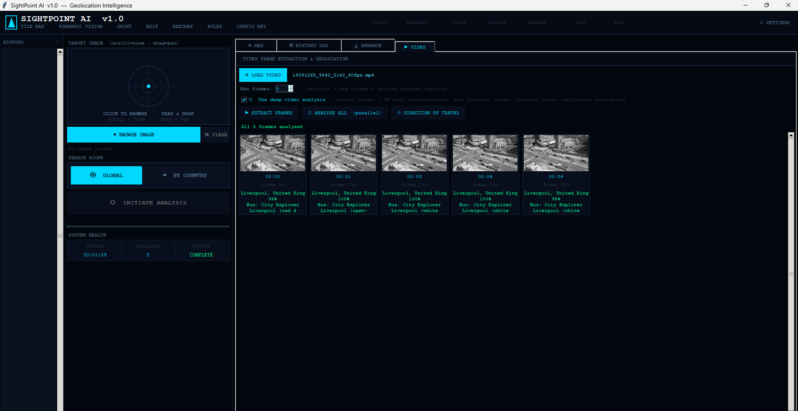
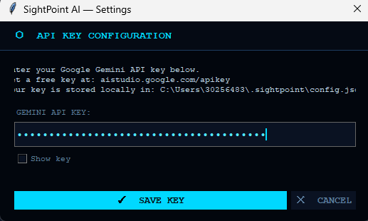

<div align="center">

<pre>
╔══════════════════════════════════════════════════════════════════╗
║     SightPoint AI  v1.0  —  Visual Geolocation Intelligence      ║
║  Fully self-contained — all maps render inside the tkinter UI   ║
║  No browser opened. No local server. No external windows.       ║
║              AI-powered OSINT geolocation tool.                 ║
╚══════════════════════════════════════════════════════════════════╝
</pre>

**AI-powered OSINT geolocation tool. Upload an image — get coordinates.**


</div>

<p align="center">
  
</p>

## Contents

- [What is SightPoint AI?](#what-is-sightpoint-ai)
- [How it works](#how-it-works)
- [Features](#features)
- [Cogs](#cogs)
- [Options & Theme system](#options--theme-system)
- [Requirements](#requirements)
- [Getting a Gemini API key](#getting-a-gemini-api-key)
- [Installation](#installation)
- [Project structure](#project-structure)
- [Usage notes](#usage-notes)
- [Ethical use](#ethical-use)
- [Licence](#licence)

---

## What is SightPoint AI?

SightPoint AI is a desktop OSINT geolocation tool. You give it an image — a street photo, a landscape, a screenshot — and it analyses the visual content to estimate where in the world it was taken. Results include GPS coordinates, a confidence score, an interactive map, and a detailed breakdown of the visual evidence used to reach the conclusion.

Everything runs inside a single window. No browser is opened, no local server is started, no external windows appear.

<p align="center">
  
</p>

[Showcase](https://streamable.com/ycx9r8)

---

## How it works

SightPoint AI is powered by **Google Gemini 2.5 Flash Lite**, a multimodal AI model capable of analysing image content with high accuracy. When you submit an image, the tool:

1. Extracts any embedded **EXIF metadata** (GPS coordinates, camera model, timestamp) and passes this to the model as additional context
2. Sends the image to the Gemini Vision API along with a structured forensic analysis prompt
3. The model performs a four-phase analysis:
   - **Forensic Vision** — architecture style, road infrastructure, vegetation, vehicle types, clothing, cultural signage
   - **OSINT Indicators** — licence plate formats, railway gauge, aviation tail prefixes, language/script identification, driving side
   - **Forensic Estimation** — OCR of all visible text, sun azimuth and shadow analysis, hemisphere estimation
   - **Triangulation** — synthesises all evidence into a ranked set of candidate locations
4. Results are rendered directly inside the app: coordinates, confidence score, deduction reasoning, visual markers, OSINT fields, and a heatmap of candidate locations on the embedded map

Map tiles are fetched from OpenStreetMap (road/terrain) and Google Maps (satellite/hybrid) and rendered entirely within the tkinter interface.

<p align="center">
  
</p>

---

## Features

**Geolocation analysis**
- Single-image geolocation via Gemini Vision API
- Global scope or country-restricted analysis
- Confidence scoring (HIGH / MEDIUM / LOW with percentage)
- Chain-of-evidence reasoning output
- Up to 5 labelled visual clue markers per analysis
- 
**OSINT indicator extraction**
- Licence plate format and country identification
- Railway gauge estimation from sleeper spacing
- Aviation tail number prefix detection
- Language and script identification
- Driving side (LHT / RHT) determination
- Full OCR of all visible text
- Sun azimuth and hemisphere estimation
- 
**Deep Analysis engine (optional)**
- 15 specialised forensic modules that run in parallel after the main geolocation completes, each voting on a region based on a different category of evidence
- Covers electoral signage, retail chain footprint, licence plate format forensics, power grid/pylon design, on-screen broadcast branding, cycling infrastructure, tree species and phenology, utility company branding, building construction conventions, cloud/weather patterns, EXIF camera metadata, telecom tower design, street art regional style, comprehensive seasonal analysis, and sign/fixture mounting hardware
- A Conflict Resolver combines every module's votes with the main geolocation result into a single weighted regional consensus
- Fully asynchronous — runs in the background without blocking the main analysis or UI
- Per-image, per-module result caching avoids re-paying the API cost on repeat runs
- Completely optional — off by default, toggled from the Options panel, with a configurable timeout
- 
**AI-determined image enhancement**
- Gemini analyses each image and identifies quality issues — motion blur, defocus, low contrast, noise, underexposure, overexposure, colour cast, compression artefacts
- No preset filter — the AI chooses the specific combination and parameters of PIL operations tailored to each image
- Available operations include sharpness boost, contrast correction, brightness adjustment, colour saturation, unsharp mask edge recovery, edge enhancement, detail filter, median noise reduction, gaussian denoise, and auto-levels channel stretching
- Before/after split-view preview inside the app
- Gemini's written assessment and reasoning displayed alongside the operations it chose
- One-click handoff — apply the enhanced image directly to the main geolocation analysis panel
- Works on any image: uploaded photos, clipboard pastes, and extracted video frames
- Fully local processing — Gemini only recommends the operations, PIL executes them on your machine
- 
**Video frame geolocation**
- Load a video clip (MP4, AVI, MOV, MKV, WebM, GIF) and extract frames at evenly-spaced intervals using direct timestamp seeking — no slow frame-by-frame scanning
- Every extracted frame is analysed in parallel, not sequentially, so a full set of frames comes back in roughly the time a single image would take
- Optional **deep analysis mode** — a significantly extended prompt tuned to discriminate between visually similar cities (e.g. Manchester vs Liverpool) using bus livery, tram overhead wires, waterfront architecture, football club colours, and calibrated confidence scoring that won't claim high certainty without a specific identifiable landmark
- **Direction of travel** estimation — compares the first and last extracted frames to infer movement type, speed, compass heading, and route clues
- Per-frame result badges (location + confidence, and in deep mode, bus/tram/football clues) shown directly on the thumbnail grid
- 
**Embedded interactive map**
- Four tile layers: Road (dark-themed OSM), Satellite, Hybrid, Terrain
- Pan, zoom (scroll wheel or buttons), crosshair
- Pin drop at identified location with label bubble
- Heatmap overlay of weighted candidate locations
- Distance ruler tool
- Coordinate display on mouse hover
- 
**EXIF analysis**
- Extracts GPS coordinates, camera make/model, and timestamp
- Uses embedded GPS as strong prior for the AI analysis
- Displays EXIF data in the results panel
- 
**Options & Theme system**
- Settings dropdown in the header with three screens: Options, API Key, and Theme
- Every data-extraction and logging toggle organised into collapsible categories, saved immediately to a profile file — no separate save step
- Five built-in themes (Cyber Dark, Light Mode, Solarized Dark, Midnight Purple, High Contrast) plus unlimited custom ones, each just a `.py` file you can copy and edit
- Full custom colour picker for every UI role and font family/size controls, applied live with no restart needed
- Ready-made settings profiles (fast, thorough, ethical) for different use cases
- 
**History and logging**
- History tab with sortable table and detail panel
- Click any past session to reload result and image
- Full CSV history log saved automatically to your home directory
- One-click coordinate copy to clipboard
- 
**Interface**
- Fully self-contained tkinter UI with a live theme system — five built-in themes plus unlimited custom ones
- HUD showing uptime, analysis count, and system status
- Terminal console with timestamped log output
- Pan/zoom viewer for the uploaded image

---

## Cogs

SightPoint AI uses a modular **cog system**. Each cog is a self-contained Python module that adds functionality by injecting itself into the running application — typically as a new tab in the interface. Cogs are loaded automatically from the `cogs/` folder on launch. No changes to the core application are needed to add or remove a cog.

### 🔬 Enhance

The Enhance cog adds AI-determined image enhancement. Rather than applying a fixed filter, it sends the image to Gemini for a quality assessment. Gemini identifies specific problems (blur type, noise level, contrast issues, colour cast) and returns a tailored plan — which PIL operations to apply, in what order, with what parameters. The enhancement is executed locally with PIL; Gemini never generates or modifies pixels directly.

The tab provides a before/after preview, Gemini's written assessment with a quality score out of 10, and the exact operations and parameters that were chosen. The enhanced image can be pushed to the main analysis panel with one click.

<p align="center">
  
</p>

### ▶ Video

*Released 19/07/26.*

The Video cog adds full video clip analysis. Load a video file and it extracts frames at evenly-spaced intervals by seeking directly to each timestamp — a 40-second clip with 20 requested frames captures one frame every 2 seconds almost instantly, with no frame-by-frame scanning. Every extracted frame is then geolocated in parallel, so a full batch comes back in roughly the time a single image analysis takes.

Flip on **deep analysis mode** for footage where standard geolocation struggles to tell visually similar places apart — it uses an extended checklist (bus operator liveries, tram overhead wires, waterfront landmarks, football club colours, street furniture) and deliberately calibrated confidence, so it won't claim high certainty without something concrete to point to.

**Direction of travel** compares the first and last frame of a clip to estimate movement type, speed, compass heading, and any visible route clues — useful for figuring out where a walking or driving video started and ended up.

<p align="center">
  
</p>

### Writing your own cog

To create a new cog:

1. Create a Python file in the `cogs/` folder (e.g. `cogs/mycog.py`)
2. Implement a `setup(app)` function that receives the running `SightPointApp` instance
3. Use `app._nb` to add a tab, `app._term` to log to the terminal, `app._map` to interact with the map, and `app._hud` to update the status display

The cog is discovered and loaded automatically on the next launch. No registration or configuration is required.

---

## Options & Theme system

The **⬡ SETTINGS ▾** dropdown in the header gives access to three screens:

**⚙ Options** — every data-extraction and logging toggle available to cogs (EXIF, OCR, vehicle detection, reverse search, temporal analysis, regional fingerprinting, confidence tracking, reporting, performance/caching, and ethical safeguards), organised into collapsible categories. This is the exact same panel docked on the left side of the main window — the dropdown just gives you a resizable standalone version of it. Every checkbox, dropdown, and spinbox here saves immediately to `options_profiles/default.json`; there's no separate save step.

**🔑 API Key** — update your Gemini API key at any time, stored at `~/.sightpoint/config.json`.

**🎨 Theme** — five ready-made presets (Cyber Dark, Light Mode, Solarized Dark, Midnight Purple, High Contrast) plus a full custom colour picker for every UI role (backgrounds, borders, accents, text, status colours) and font family/size controls. Changes apply live to the running app — no restart needed — and are saved to `~/.sightpoint/theme.json` so your theme persists between launches.

Every preset is just a `.py` file in `customise/themes/` — there's nothing hardcoded. To make your own:

1. Copy `customise/themes/theme_example.py` to a new file, e.g. `customise/themes/my_theme.py`
2. Change `NAME` and edit the `THEME` dict — leave out anything you don't want to customise and it falls back to the Cyber Dark default automatically
3. Click **↻ Rescan** in the Theme dialog — your theme appears in the preset list immediately, no restart required

Malformed theme files are skipped with a warning rather than crashing the app, so it's safe to experiment.

Settings are stored per-profile in `options_profiles/` (see `fast.json`, `thorough.json`, `ethical.json` for ready-made starting points) rather than in your home directory, so a profile can be copied, versioned, or shared alongside the project itself. Launch with a specific profile using:

```bash
python main.py --options-file options_profiles/thorough.json
```

---

## Requirements

- Python 3.9 or later
- A free Google Gemini API key (see below)

**Python dependencies:**

```
pillow
requests
```

Video frame extraction additionally requires `opencv-python` (optional — the cog degrades gracefully without it, minus GIF/video frame seeking).

---

## Getting a Gemini API key

SightPoint AI uses the **Google AI Studio** API — this is free to use and does not require a Google Cloud account or billing setup.

**Step 1 — Go to Google AI Studio**

Visit [aistudio.google.com/apikey](https://aistudio.google.com/apikey) and sign in with a Google account.

**Step 2 — Create an API key**

Click **Create API key**, then select **Create API key in new project** (or use an existing project if you have one). Copy the generated key — it starts with `AIza`.

**Step 3 — No further setup required**

Unlike the Google Cloud Console APIs, the Gemini API via AI Studio does not require you to enable any additional services, set up billing, or configure OAuth. The key works immediately.

> **Note:** The free tier has usage limits (requests per minute / per day). For casual OSINT use these limits are unlikely to be hit. If you receive a `403 quota exceeded` error, check your usage at [aistudio.google.com](https://aistudio.google.com).

---

## Installation

### Run from source (recommended)

**1. Clone the repository**

```bash
git clone https://github.com/camysticc/sightpoint.git
cd sightpoint
```

**2. Install dependencies**

```bash
pip install pillow requests
```

**3. Run the app**

```bash
python main.py
```

**4. Enter your API key**

On first launch, a Settings dialog will appear automatically. Paste your Gemini API key and click **Save Key**. The key is stored locally at `~/.sightpoint/config.json` and never transmitted anywhere except directly to the Gemini API.

<p align="center">
  
</p>

You can update your key at any time via the **⬡ SETTINGS ▾** dropdown in the top-right of the application header — it opens a menu with **Options**, **API Key**, and **Theme**.

---

## Project structure

```
sightpoint/
├── main.py               ← entry point (run this)
├── sightpoint.py         ← core application (map, analysis, UI)
├── cogs/
│   ├── __init__.py       ← package marker
│   ├── enhance.py        ← AI image enhancement cog
│   └── video.py          ← video frame analysis cog
├── options/
│   ├── __init__.py       ← thread-safe load/save/get/set for options_profiles/
│   ├── settings.py       ← DEFAULT_OPTIONS, CSV headers, metadata schema
│   ├── sidebar.py        ← SettingsSidebar (docked panel + Options dialog)
│   ├── logging.py        ← history CSV read/write utilities
│   └── metadata.py       ← per-image JSON metadata store + CSV export
├── options_profiles/
│   ├── default.json      ← active profile (created on first launch)
│   ├── fast.json         ← minimal extraction, quick lookups
│   ├── thorough.json     ← everything enabled, max evidence
│   └── ethical.json      ← privacy-first, logging disabled
├── customise/
│   ├── __init__.py            ← package marker
│   ├── customise_engine.py    ← theme discovery, load/save/apply
│   ├── theme_dialog.py        ← Theme picker window (with live Rescan)
│   └── themes/
│       ├── cyber_dark.py       ← default theme
│       ├── light_mode.py
│       ├── solarized_dark.py
│       ├── midnight_purple.py
│       ├── high_contrast.py
│       └── theme_example.py    ← copy this to make your own
└── graphics/              ← README assets
```

---

## Usage notes

- Supported image formats: JPG, JPEG, PNG, WebP, GIF
- Larger images take longer to process — the Gemini API has a 120-second timeout
- The tool is designed for images with visible geographic content (streets, buildings, landscapes, signage). Abstract or interior images will produce low-confidence results
- Analysis history is saved to `~/sightpoint_history.csv` automatically after each run
- Map tiles require an internet connection; the app will display a placeholder grid if tiles cannot be fetched
- Image enhancement runs entirely on your machine — Gemini only provides the recommendation, PIL applies the operations locally
- Video deep analysis mode uses a longer prompt and takes a little longer per frame in exchange for materially better accuracy on visually similar locations

---

## Ethical use

SightPoint AI is built for legitimate OSINT research, journalism, due diligence, and educational purposes. It analyses only images you provide — it does not scrape, monitor, or collect any external data.

Users are responsible for ensuring their use complies with applicable laws and platform terms of service. Do not use this tool to identify or locate individuals without lawful basis.

---

## Licence

MIT Licence — see [LICENSE](LICENSE) for details.

---
